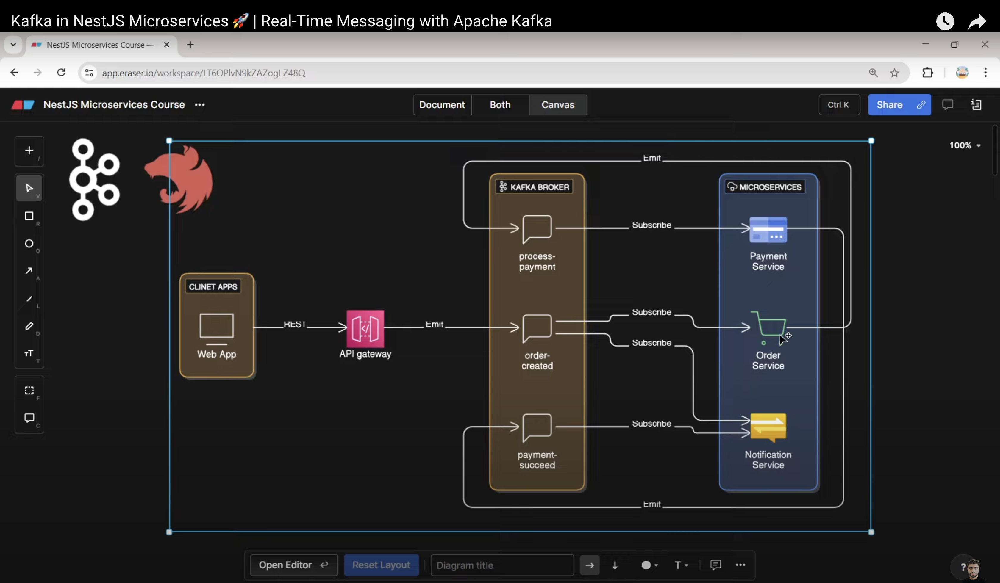

<p align="center">
  <a href="http://nestjs.com/" target="blank"></a>
  <h1 align="center">NestJS Kafka Microservices</h1>
</p>

## 📌 Overview

This project demonstrates a microservices architecture using NestJS with Kafka as the message broker. It includes an API Gateway and three microservices (Order, Payment, and Notification) that communicate asynchronously through Kafka events.

## � Architecture Diagram



## 🧩 Services & Kafka Topics

### API Gateway (`api-gateway`)
- **Endpoints**:
  - `POST /order`: Creates new orders and publishes to Kafka
  ```typescript
  @Post('order')
  createOrder(@Body() order: any) {
    this.kafkaClient.emit('order-created', order);
    return { message: 'Order sent to kafka', order };
  }
  ```
- **Publishes to**: `order-created` topic

### Order Service (`order-microservice`)
- **Subscribes to**: `order-created`
- **Publishes to**: `process-payment`
```typescript
@MessagePattern('order-created')
handleOrderCreated(@Payload() order: any) {
  console.log('[Order-Service]: Received new order:', order);
  this.kafkaClient.emit('process-payment', order);
}
```

### Payment Service (`payment-microservice`)
- **Subscribes to**: `process-payment`
- **Publishes to**: `payment-succeed`
```typescript
@MessagePattern('process-payment')
processPayment(@Payload() data: any) {
  console.log('[Payment Service] Payment is process', data);
  this.kafkaClient.emit('payment-succeed', data);
}
```

### Notification Service (`notification-microservice`)
- **Subscribes to**:
  - `order-created`: Sends order confirmation
  - `payment-succeed`: Sends payment confirmation
```typescript
@MessagePattern('order-created')
sendOrderCreateNotification(@Payload() data: any) {
  console.log(`[Notification Service] Sending Order Created Email`, data);
}

@MessagePattern('payment-succeed')
sendPaymentSucceedNotificaion(@Payload() data: any) {
  console.log(`[Notification Service] Sending Payment Succeed Email`, data);
}
```

## 🔄 Communication Flow

1. Client → `POST /order` to API Gateway
2. API Gateway → Publishes to `order-created`
3. Order Service:
   - Receives order
   - Publishes to `process-payment`
4. Payment Service:
   - Processes payment
   - Publishes to `payment-succeed`
5. Notification Service:
   - Sends notifications for both events

## 🚀 Getting Started

### Prerequisites
- Node.js v16+
- Docker & Docker Compose
- pnpm

### Installation
```bash
git clone https://github.com/rahijamil/nestjs-kafka.git
cd nestjs-kafka
pnpm install
```

### Running the System
1. Start infrastructure:
```bash
docker-compose up -d
```

2. Run services (in separate terminals):
```bash
# API Gateway
pnpm start:dev api-gateway

# Order Service
pnpm start:dev order-microservice

# Payment Service
pnpm start:dev payment-microservice

# Notification Service
pnpm start:dev notification-microservice
```

## 🌐 Testing the Flow
1. Create an order:
```bash
curl -X POST http://localhost:3000/order \
  -H "Content-Type: application/json" \
  -d '{"product": "Laptop", "amount": 999.99}'
```

2. Observe logs in:
- Order Service (order received)
- Payment Service (payment processed)
- Notification Service (notifications sent)